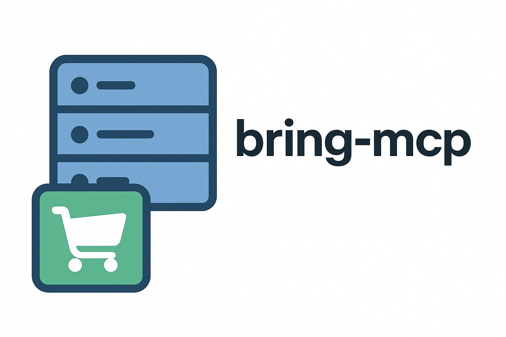

# MCP Server for Bring! Shopping



This project implements a local Model Context Protocol (MCP) server in TypeScript that exposes the functionalities of the Bring! shopping list API. It enables applications like Claude Desktop to interact with your Bring! shopping lists using standardized MCP tools.

The server integrates the `bring-shopping` npm package for Bring! API access and leverages `@modelcontextprotocol/sdk` to provide an MCP-compliant server interface.

> **Disclaimer:**  
> This is a personal project. I am not affiliated with Bring! Labs AG in any way.  
> This project uses an **unofficial Bring! API**, which may change or be blocked at any time.  
> This could cause the MCP server to stop functioning without prior notice.

---

## 🧩 Recommended Claude Desktop Configuration

To use this server in Claude Desktop via `npx`, insert the following into your `claude_desktop_config.json` file:

```json
{
  "mcpServers": {
    "bring-mcp": {
      "command": "npx",
      "args": ["-y", "bring-mcp@latest"],
      "env": {
        "MAIL": "your_bring_email@example.com",
        "PW": "YOUR_BRING_PASSWORD_HERE"
      }
    }
  }
}
```

This is the recommended and most portable configuration. It ensures you always use the latest version published to npm without needing local installation.

---

## 🚀 Features

- **Automatic Authentication**: No manual login required - authentication happens automatically on first API call
- Exposes Bring! API functions as MCP tools:
  - 🧾 Load shopping lists
  - 🛒 Get and modify items (add, remove, move)
  - 📦 Batch operations (save multiple items, delete multiple items)
  - 🖼 Save/remove item images
  - 👥 Manage list users
  - 🎯 Get default shopping list UUID
  - 🌐 Load translations & catalog
  - 📨 Retrieve pending invitations
- Communicates via STDIO (for use with Claude Desktop or MCP Inspector)
- Supports Bring! credentials via `.env` file or injected environment variables

### Available Tools

- **`loadLists`**: Load all shopping lists from Bring!
- **`getItems`**: Get all items from a specific shopping list
- **`getItemsDetails`**: Get details for items in a list
- **`saveItem`**: Save an item to a shopping list with optional specification
- **`saveItemBatch`**: Save multiple items to a shopping list in one operation
- **`removeItem`**: Remove an item from a specific shopping list
- **`moveToRecentList`**: Move an item to the recently used items list
- **`deleteMultipleItemsFromList`**: Delete multiple items from a list by their names
- **`saveItemImage`**: Save an image for an item on a shopping list
- **`removeItemImage`**: Remove an image from an item
- **`getAllUsersFromList`**: Get all users associated with a shopping list
- **`getUserSettings`**: Get settings for the authenticated user
- **`getDefaultList`**: Get the UUID of the default shopping list (use when user doesn't specify a list)
- **`loadTranslations`**: Load translations for the Bring! interface
- **`loadCatalog`**: Load the Bring! item catalog
- **`getPendingInvitations`**: Get pending invitations to join shopping lists

---

## ⚙️ Setup and Installation

1. **Clone the repo (or obtain the files)**

2. **Navigate into the project directory:**

   ```bash
   cd path/to/bring-mcp
   ```

3. **Install dependencies:**

   ```bash
   npm install
   ```

4. **Create `.env` file (if not injecting ENV directly):**

   ```env
   MAIL=your_email@example.com
   PW=your_password
   ```

5. **Build the project:**

   ```bash
   npm run build
   ```

6. **Make script executable (optional on Unix):**

   ```bash
   chmod +x build/src/index.js
   ```

---

## 🏃 Running the Server

Launch the MCP server with:

```bash
node build/src/index.js
```

If successful, you'll see: `MCP server for Bring! API is running on STDIO` (on `stderr`).

---

## 🧪 Testing with MCP Inspector

1. Ensure `npm run build` has been executed.
2. Ensure `.env` with valid credentials exists.
3. Run Inspector:

   ```bash
   npx @modelcontextprotocol/inspector node /ABS/PATH/bring-mcp/build/src/index.js
   ```

---

## 🧩 Claude Desktop Integration (Manual Local Setup)

Alternatively, if you prefer a locally built and installed version:

```json
{
  "mcpServers": {
    "mcp-bring": {
      "command": "node",
      "args": ["/ABSOLUTE/PATH/TO/bring-mcp/build/src/index.js"],
      "env": {
        "MAIL": "your_bring_email@example.com",
        "PW": "YOUR_BRING_PASSWORD_HERE"
      }
    }
  }
}
```

---

## 🔧 Development

### Testing

Run tests with:

```bash
npm run test
```

This command runs formatting, linting, and Jest tests with coverage reporting.

For CI testing:

```bash
npm run test:ci
```

### Building

Build the project:

```bash
npm run build
```

### Key Dependencies

- `@modelcontextprotocol/sdk`: For MCP server implementation
- `@modelcontextprotocol/inspector`: For testing and debugging MCP servers
- `bring-shopping`: Node.js wrapper for the Bring! API
- `zod`: For schema definition and validation
- `dotenv`: For managing environment variables

---

## ✅ Final Notes

- 🔒 Avoid committing your `.env` file.
- 🧼 Keep credentials out of version control.
- 🛠 MCP Inspector is invaluable for debugging.
- 🔄 Authentication is handled automatically - no manual login required.
- 📦 Use batch operations for efficiency when working with multiple items.

Happy coding with MCP and Bring! 🎉
